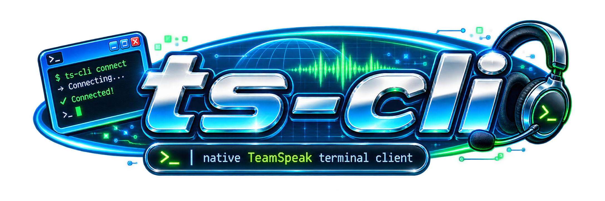

# ts-cli

[](LICENSE)
[](CONTRIBUTING.md)
[](BUILDING.md)

**A native TeamSpeak voice client for the terminal, written in C++20.**

`ts-cli` is a terminal-first TeamSpeak client, built natively for Linux and cross-compiled to Windows. It connects directly using the TeamSpeak client protocol and implements the connection, session crypto, command transport, channel/client state, messaging, and voice path natively.

It does **not** use the proprietary TeamSpeak SDK, and it is **not** a ServerQuery wrapper.

If you want to join a server, talk, listen, move between channels, send messages, tune individual users, and manage audio without leaving your terminal, that is exactly what `ts-cli` is built for.

<p align="center">
  
</p>

> [!NOTE]
> `ts-cli` is under active development. The goal is not to reproduce every feature of the desktop client, but to provide a small, capable, understandable terminal client for everyday TeamSpeak use.

> [!TIP]
> Windows support is experimental: navigation, chat, configuration, and voice (via WASAPI) all work, but the Windows audio backend hasn't been exercised on real hardware yet — see [BUILDING.md](BUILDING.md) for the full picture and known limitations.

## What you can do

With `ts-cli`, you can:

* connect directly to TeamSpeak servers;
* browse channels and connected users;
* join and move between channels;
* talk and listen using PipeWire;
* send channel messages;
* send private messages and reply to the last PM;
* change your nickname at runtime;
* select input and output devices;
* mute and unmute your microphone;
* use configurable voice activation;
* optionally filter microphone input with RNNoise;
* adjust individual users without affecting anyone else;
* locally mute individual remote users;
* keep useful preferences across sessions.

The client keeps its state and configuration in standard XDG locations and starts every session with the microphone muted.

---

## Quick start

> This assumes your build dependencies are already installed. First time here? Set up your environment with [BUILDING.md](BUILDING.md) — it covers both Linux and Windows.

Build the project:

```bash
./build.sh
```

Connect to a server:

```bash
build/client/ts-cli voice.example.net:9987
```

Once connected, type normally to send a message to the current channel:

```text
hello everyone
```

Commands start with `/`:

```text
/list
/join Gaming
/unmute
```

When you are finished:

```text
/quit
```

<p align="center">
  
</p>

---

## Example session

A typical session might look like this:

```text
$ build/client/ts-cli voice.example.net:9987

Connected as frAgZ

Lobby
├── Alice
├── Bob
└── MusicBot

> hello everyone
[Lobby] frAgZ > hello everyone

> /join Gaming
Joined channel: Gaming

Gaming
├── Alice
└── Bob

> anyone up for a game?
[Gaming] frAgZ > anyone up for a game?

> /message Alice joining in 5
[to Alice] joining in 5

> /r sounds good
[to Alice] sounds good

> /unmute
microphone unmuted
```

The terminal remains the primary interface throughout the session.

---

# Everyday usage

## See who is online

Use `/list` to inspect channels and users.

```text
/list
```

Example:

```text
Lobby
├── Alice
├── Bob
└── MusicBot

Gaming
├── Charlie
└── Dave

AFK
└── Eve
```

You can also inspect a specific channel:

```text
/list Gaming
```

This is useful when you want to check who is around before moving.

---

## Join a channel

```text
/join Gaming
```

If a channel name contains spaces, quote it where required:

```text
/join "Late Night Gaming"
```

Once joined, normal text is sent to that channel:

```text
anyone still playing?
```

---

## Send private messages

Use either `/pm` or `/message`:

```text
/message Alice are you joining voice?
```

or:

```text
/pm Alice are you joining voice?
```

Reply to the last private message with:

```text
/r yep, give me a minute
```

This is especially convenient when you are already talking to someone and do not want to keep retyping their name.

---

## Change your nickname

```text
/nick frAgZ-laptop
```

The change applies to the current running client and is reflected on the server.

---

# Voice

`ts-cli` supports both TeamSpeak **Opus Voice** and **Opus Music** channels.

The audio path is native:

```text
PipeWire capture
      ↓
optional capture filter
      ↓
voice-activity detection
      ↓
Opus encode
      ↓
TeamSpeak voice packets
      ↓
network
      ↓
per-talker jitter / loss recovery
      ↓
Opus decode
      ↓
per-user volume / local mute
      ↓
mix
      ↓
PipeWire playback
```

The microphone starts muted every time the client launches.

When you are ready to speak:

```text
/unmute
```

Mute again with:

```text
/mute
```

<p align="center">
  
</p>

## Voice activation

`ts-cli` can automatically open and close transmission based on microphone level.

For example:

```text
/audio threshold -45
```

The threshold is expressed in **dBFS**.

A lower value is more sensitive:

```text
/audio threshold -55
```

A higher value requires louder input:

```text
/audio threshold -35
```

A practical starting point for many microphones is around:

```text
/audio threshold -45
```

Your microphone remains logically unmuted while voice activation decides when actual voice packets should be transmitted.

That prevents the client from appearing to transmit continuously during silence.

---

## RNNoise

If `ts-cli` was compiled with RNNoise support, microphone noise filtering can be enabled with:

```text
/audio filter rnnoise
```

Disable it again with:

```text
/audio filter none
```

Check the current audio state with:

```text
/audio status
```

RNNoise is applied before voice-activity detection and Opus encoding.

---

# Audio devices

List available PipeWire devices:

```text
/audio devices
```

Select the default input:

```text
/audio input default
```

Or choose a specific device:

```text
/audio input <id>
```

A device name may also be used where supported:

```text
/audio input "USB Microphone"
```

Select an output device in the same way:

```text
/audio output default
```

or:

```text
/audio output "USB Headset"
```

A common setup might therefore look like:

```text
/audio input "USB Microphone"
/audio output "HD Audio Controller"
/audio filter rnnoise
/audio threshold -42
/unmute
```

See [Audio and voice](docs/client/audio.md) for the full audio model.

---

# Per-user controls

One of the more useful features of `ts-cli` is the ability to adjust remote users locally.

These settings affect only your client.

## Lower a loud user

```text
/user Alice volume -8
```

Or use a percentage:

```text
/user Alice volume 70%
```

Restore the default:

```text
/user Alice volume reset
```

Example:

```text
> /user MusicBot volume -14
MusicBot volume: -14.0 dB
```

This is particularly useful for music bots, users with unusually loud microphones, or anyone whose level does not match the rest of the channel.

---

## Locally mute a user

```text
/user MusicBot mute
```

Restore them later:

```text
/user MusicBot unmute
```

This does not change their server permissions or mute state for anybody else.

---

## Inspect a user

```text
/user Alice
```

When nicknames are ambiguous, use the TeamSpeak client ID:

```text
/user #42
```

For example:

```text
/user #42 volume -10
```

Persistent settings are stored using the user's stable TeamSpeak identity rather than their nickname or temporary client ID.

That means a saved volume adjustment continues to apply even if that person reconnects with another client ID or changes their nickname.

---

# Useful scenarios

## Stay inside tmux or zellij

A terminal-native voice client fits naturally beside shells, editors, build output, logs, and monitoring tools.

For example:

```text
┌───────────────────────────────┬──────────────────────┐
│                               │                      │
│            nvim               │      build logs      │
│                               │                      │
├───────────────────────────────┼──────────────────────┤
│                               │                      │
│           shell               │       ts-cli         │
│                               │                      │
└───────────────────────────────┴──────────────────────┘
```

No extra desktop window is required just to stay in voice.

---

## Check a server quickly

Sometimes you do not need to talk at all.

Connect:

```bash
build/client/ts-cli voice.example.net:9987
```

Then:

```text
/list
```

You can quickly check whether people are online, what channels are active, and whether it is worth joining.

---

## Keep a music bot under control

Suppose a music bot joins every evening and is consistently too loud.

Set it once:

```text
/user MusicBot volume -12
```

The preference is persisted using its TeamSpeak identity.

The next time that same user connects, the adjustment remains available without relying on its current client ID.

---

## Switch from speakers to a headset

You can change playback devices without restarting the client.

```text
/audio devices
/audio output "USB Headset"
```

Then switch your microphone too:

```text
/audio input "USB Headset Microphone"
```

Inspect the result:

```text
/audio status
```

---

## Tune voice activation

Start with:

```text
/audio threshold -45
```

If keyboard noise triggers transmission:

```text
/audio threshold -38
```

If your voice is being cut off:

```text
/audio threshold -50
```

If RNNoise is available, combine both:

```text
/audio filter rnnoise
/audio threshold -45
```

<p align="center">
  
</p>

---

# Command reference

Typing text without a leading slash sends it to the current channel.

## Messaging

```text
/pm <client> <text>
/message <client> <text>
/r <text>
```

Examples:

```text
/message Alice ping me when you're ready
/pm Bob check your microphone
/r yep, works now
```

## Channels

```text
/join <channel>
/list [channel]
```

Examples:

```text
/join Lobby
/join "Late Night Gaming"
/list
/list Lobby
```

## Nickname

```text
/nick <new name>
```

Example:

```text
/nick frAgZ-workstation
```

## Per-user controls

```text
/user <client>
/user <client> volume <dB|percent|reset>
/user <client> mute
/user <client> unmute
```

Examples:

```text
/user Alice
/user Alice volume -6
/user Bob volume 80%
/user MusicBot mute
/user #42 volume reset
```

## Microphone

```text
/mute
/unmute
```

## Audio

```text
/audio status
/audio devices
/audio input <default|id|name>
/audio output <default|id|name>
/audio filter
/audio filter rnnoise
/audio filter none
/audio threshold <dBFS>
```

## Client

```text
/help
/quit
```

<p align="center">
  
</p>

---

# Building

`ts-cli` builds natively on Linux and cross-compiles to Windows via MinGW-w64 (tested under Wine).

Full environment setup, dependency lists for Arch and Debian/Ubuntu, and the Windows cross-compilation walkthrough live in **[BUILDING.md](BUILDING.md)**.

Once dependencies are installed, the short version is:

```bash
./build.sh
```

The resulting binary is:

```text
build/client/ts-cli
```

---

# Running the client

The command syntax is:

```bash
build/client/ts-cli <host>:<port>
```

For example:

```bash
build/client/ts-cli voice.example.net:9987
```

After connecting, transmission remains disabled until you explicitly run:

```text
/unmute
```

This behavior is intentional: local microphone mute state is never restored from a previous session.

---

# Configuration

`ts-cli` uses the standard XDG configuration directory:

```text
$XDG_CONFIG_HOME/ts-cli/
├── config.conf
├── identity
└── users/
    └── <remote-identity>.conf
```

When `XDG_CONFIG_HOME` is unset, this becomes:

```text
~/.config/ts-cli/
```

The configuration is deliberately separated by responsibility:

```text
identity
    local TeamSpeak identity

config.conf
    client-wide behavior and preferences

users/<remote-identity>.conf
    local settings for individual remote users
```

---

## `config.conf`

General settings are stored in:

```text
~/.config/ts-cli/config.conf
```

For example:

```ini
nickname=ts-cli

audio_input=default
audio_output=default
audio_filter=none
audio_activation_threshold_db=-45
```

TeamSpeak client-version metadata is configurable as well and is treated internally as a single coherent wire profile.

---

## `identity`

The client's TeamSpeak identity is stored separately:

```text
~/.config/ts-cli/identity
```

`ts-cli` uses a single persistent local identity across sessions.

Older installations containing legacy `identity_*` entries in `config.conf` are migrated safely: the standalone identity file is written before the obsolete configuration entries are removed.

---

## Per-user configuration

Individual user settings live under:

```text
~/.config/ts-cli/users/
```

A stored user configuration may look like:

```ini
volume_db=-8
muted=false
```

Files are keyed by the remote user's stable TeamSpeak unique identity.

This means:

```text
Alice → reconnects → receives another client ID → same local settings
```

Nicknames and transient client IDs are not used as persistent keys.

---

# How it works

The project implements the TeamSpeak client path itself rather than delegating it to the proprietary SDK.

Major pieces include:

* native TeamSpeak UDP connection and handshake;
* session encryption;
* packet sequencing and acknowledgements;
* reliable command transport;
* QuickLZ command decompression;
* TeamSpeak identity handling;
* live channel and client state;
* command and text-message handling;
* Opus Voice and Opus Music transmission;
* Opus receive and decode;
* per-talker packet reordering;
* jitter handling and loss recovery;
* PipeWire capture and playback;
* local audio mixing;
* per-user gain and mute handling;
* persistent client and remote-user configuration.

For protocol details, see the documentation under [`docs/`](docs/README.md).

---

# Project structure

```text
ts-cli/
├── audio/       # PipeWire, Opus, filters, jitter, mixing and audio worker
├── client/      # CLI, configuration, persistence and runtime integration
├── docs/        # architecture and protocol documentation
├── log/         # logging
├── net/         # Linux networking
└── protocol/    # TeamSpeak protocol, crypto, session state and transport
```

The project keeps these boundaries intentionally strict.

Protocol code does not own UI or filesystem state. Audio code does not need to understand TeamSpeak command parsing. The CLI remains a relatively thin user-facing layer over the underlying runtime and state APIs.

This separation keeps the project easier to reason about, test, and extend.

---

# Documentation

User-facing documentation:

* [Documentation index](docs/README.md)
* [Audio and voice](docs/client/audio.md)
* [Runtime model](docs/client/runtime.md)
* [Configuration and identity](docs/client/configuration.md)

Building and contributing:

* [Building ts-cli](BUILDING.md) — environment setup for Linux and Windows
* [Contributing](CONTRIBUTING.md) — style, architecture and project conventions

Protocol documentation:

* [Handshake and session bootstrap](docs/protocol/handshake.md)
* [Voice protocol](docs/protocol/voice.md)

<p align="center">
  
</p>

---

# Current scope

`ts-cli` is intended to be useful for normal voice and chat interaction, but it deliberately does not attempt complete desktop-client parity.

Areas that remain smaller or incomplete include:

* advanced administration and server-management workflows;
* desktop-style UI features and overlays;
* a fully adaptive heavyweight jitter engine;
* arbitrary microphone filter chains beyond the current optional RNNoise stage;
* exclusive-mode audio and live device hot-plug notifications on Windows — the WASAPI backend covers shared-mode capture/render, device enumeration, and switching, but a device that changes while connected needs `/audio input`/`/audio output` to pick up, and hasn't yet been validated on real Windows hardware (see [BUILDING.md](BUILDING.md)).

Keeping the scope focused is intentional.

The goal is a compact native terminal client that remains understandable, hackable, and pleasant to use.

---

# Development

Build environment setup for Linux and Windows is documented in [BUILDING.md](BUILDING.md); development and contribution guidelines are documented in [CONTRIBUTING.md](CONTRIBUTING.md).

Protocol changes should remain focused, tested, and contained within the protocol layer where possible.

Audio, client runtime, and persistence changes should preserve the existing ownership boundaries between components.

---

# Disclaimer

This project is not affiliated with or endorsed by TeamSpeak Systems GmbH.

TeamSpeak and related trademarks belong to their respective owners.
