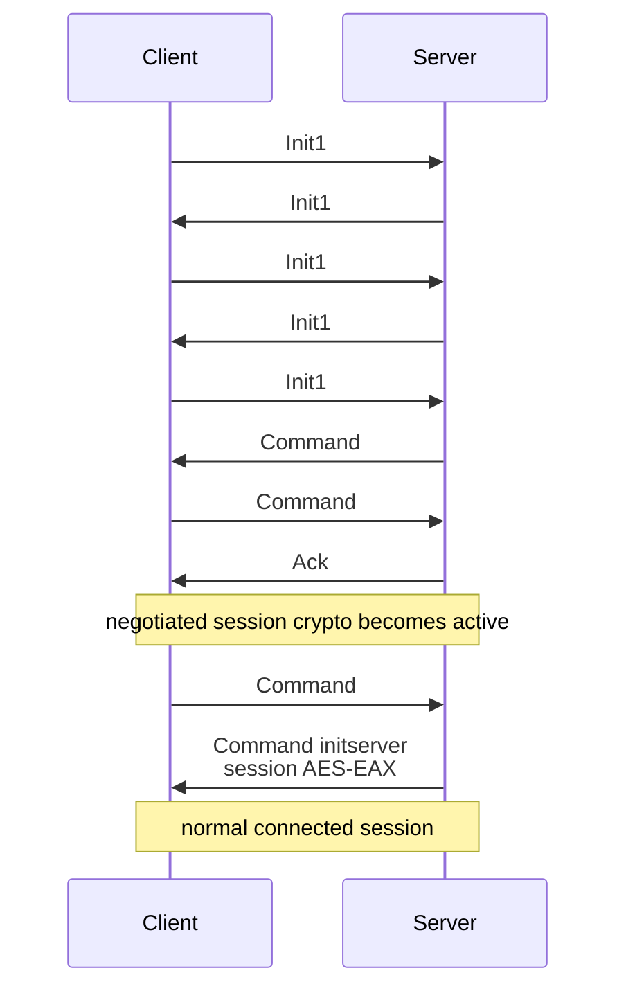

# TeamSpeak handshake and session bootstrap

This chapter describes the connection bootstrap used by `ts-cli`, from the first UDP Init1 packet until the server accepts the client and sends `initserver`.

The bootstrap has three distinct phases:

1. **Init1 bootstrap** — cookie exchange and anti-DoS puzzle.
2. **Cryptographic bootstrap** — identity exchange, server proof verification and session-key derivation.
3. **Session login** — `clientinit`, `initserver`, client ID assignment and transition into normal session traffic.

Keeping these phases separate is useful because they use different packet formats, packet IDs and encryption rules.

> `ts-cli` currently implements the modern `initivexpand2` path. The older `initivexpand` path is recognized but intentionally unsupported.

## Overview



The numeric command packet IDs shown above are important. `clientek` is already normal reliable Command packet **#1**, so the next client Command is **#2**.

## 1. UDP and Init1 bootstrap

A TeamSpeak connection begins over UDP. Init1 packets are special: they do not use the normal encrypted session packet format and they use fixed bootstrap header values.

For the Init1 exchange:

- packet type is `Init1`;
- packet ID is `101`;
- client ID is `0`;
- the Init1 marker/MAC is the fixed ASCII value `TS3INIT1`;
- the client includes its numeric Init1 client version;
- the `NewProtocol` flag is used by modern clients.

The Init1 phase establishes reachability, gives the server state that can be echoed back by the client, and forces the client to solve a computational puzzle before the expensive cryptographic bootstrap continues.

### 1.1 GetCookie — client to server

The client starts with Init1 command `0x00`.

Conceptually the packet contains:

- client Init1 version;
- command `GetCookie`;
- current Unix timestamp;
- random client bytes;
- reserved zero bytes.

The timestamp and random data make the request fresh and give the server values it can bind into the next step.

### 1.2 SetCookie — server to client

The server answers with Init1 command `0x01`.

The response contains server-provided cookie/state data plus data derived from the random bytes sent by the client. The client does not need to interpret the cookie cryptographically; it must preserve and return the values required by the next Init1 packet.

### 1.3 GetPuzzle — client to server

The client sends Init1 command `0x02`, including the server cookie/state from the previous response.

This proves that the client received the server response at the address it is currently using and asks the server for the anti-DoS puzzle.

### 1.4 Puzzle — server to client

The server responds with Init1 command `0x03` containing:

- `x` — a 64-byte unsigned big integer;
- `n` — a 64-byte unsigned big integer;
- `level` — puzzle difficulty;
- additional server state that must be echoed back.

The required solution is:

```text
y = x^(2^level) mod n
```

The result is represented as a 64-byte unsigned big integer.

This is deliberately CPU work for the connecting client. It raises the cost of opening large numbers of connections and therefore acts as part of the protocol's denial-of-service protection.

### 1.5 Init1 reset

Instead of returning puzzle command `0x03`, the server can return Init1 command `0x7f` (`Reset`).

When this happens, the client discards the current Init1 attempt and restarts at `GetCookie`. `ts-cli` limits the number of resets so a server cannot keep it in an infinite bootstrap loop.

### 1.6 PuzzleAnswer — client to server

The final Init1 packet uses command `0x04` and contains:

- the original puzzle `x`;
- the original puzzle `n`;
- the original puzzle level;
- echoed server state;
- the calculated 64-byte puzzle solution;
- an embedded `clientinitiv` command.

The embedded high-level command is significant: modern TeamSpeak servers do not require a separate standalone `clientinitiv` Command packet before `initivexpand2`.

## 2. `clientinitiv` and the persistent identity

The embedded command has the conceptual form:

```text
clientinitiv alpha=<alpha> omega=<identity-public-key> ot=1 ip=<server-ip>
```

### `alpha`

`alpha` is 10 random bytes encoded as Base64. It contributes entropy to the later session-material derivation.

### `omega`

`omega` carries the client's persistent P-256 identity public key using TeamSpeak's expected ASN.1 representation and Base64 encoding.

This P-256 keypair is the **TeamSpeak identity**. It is not a one-connection ephemeral key. Reusing the same identity lets the server recognize the same logical client across reconnects.

`ts-cli` therefore persists the private identity in its client configuration rather than generating a fresh identity for every connection.

### `ot`

`ot` is `1` for the modern identity representation used here.

### `ip`

`ip` is the final resolved IP address of the TeamSpeak server being contacted.

## 3. Fixed bootstrap encryption

After the final Init1 packet, the protocol switches to normal-looking `Command` and `Ack` packet structures, but the negotiated session keys do **not** exist yet.

The first high-level crypto messages therefore use a fixed AES-EAX bootstrap key and nonce defined by the protocol:

```text
key   = "c:\\windows\\syste"
nonce = "m\\firewall32.cpl"
```

The resulting AES-EAX authentication tag is truncated to the 8-byte TeamSpeak packet MAC.

This fixed encryption is only a bootstrap mechanism. It must not be confused with the per-session crypto derived in the next phase.

In `ts-cli`, this phase covers:

- server `initivexpand2` Command #0;
- client `clientek` Command #1;
- server Ack #0 for `clientek`.

After `clientek` is acknowledged, normal session encryption takes over.

## 4. `initivexpand2` — server to client

The server sends a fixed-bootstrap-encrypted Command packet containing `initivexpand2`.

Important fields include:

```text
initivexpand2 l=<license> beta=<beta> omega=<server-key> ot=1 proof=<proof> ...
```

### `beta`

`beta` is server-provided random material used in the modern key exchange and session-material derivation.

### `omega`

The server provides the public key material required by the modern handshake.

### `l`

`l` contains the TeamSpeak server license chain/data. The client parses this structure to obtain the keys required to verify that the server's handshake material is authentic.

### `proof`

The proof binds the server handshake to its license material. `ts-cli` verifies this proof using P-256 before accepting any derived session keys.

A failed proof is a fatal handshake error. The client must not continue with unauthenticated session material.

## 5. Modern session-material derivation

After validating the server proof, the client derives the per-session cryptographic material required by TeamSpeak's normal packet encryption.

The modern `initivexpand2` flow involves two different EC roles:

- the **persistent P-256 identity**, used for identity/signatures;
- **ephemeral Curve25519 session material**, used to establish the session secret.

The exact intermediate values are protocol-specific and are intentionally treated as temporary. Once derivation succeeds, the long-lived results needed by packet encryption are the session IV/MAC material and related client ephemeral public key data needed for `clientek`.

The key point is the trust chain:

```text
server license data
        ↓
verify initivexpand2 proof
        ↓
accept server handshake key material
        ↓
derive shared session material
        ↓
construct clientek
```

Do not derive and activate session crypto before the proof has been verified.

## 6. `clientek` — client to server

The client responds with:

```text
clientek ek=<ephemeral-client-public-key> proof=<identity-signature>
```

`ek` contains the client ephemeral public key required by the modern exchange.

The `proof` is produced with the client's persistent P-256 identity and binds the ephemeral client key to the server-provided `beta` value. This proves that the peer completing the session-key exchange also owns the private identity key previously advertised in `clientinitiv`.

### Packet sequence boundary

`clientek` is sent as reliable client **Command packet ID 1**.

The bootstrap sequence starts specially:

```text
client outgoing Command: 1
client outgoing Ack:     0
server incoming Command: 0
server incoming Ack:     0
```

After this boundary, normal packet-sequence state continues from those values. Packet IDs must not be reset when moving from bootstrap transport to session transport.

## 7. Ack for `clientek`

The server acknowledges `clientek` with the fixed bootstrap crypto.

At this point:

- the low-level Init1 phase is complete;
- server authenticity has been checked;
- the client has proved possession of its persistent identity;
- both sides have enough material for normal session encryption;
- the reliable packet sequence has already begun.

This is the crypto transition point.

## 8. Normal session encryption

From this point onward, the negotiated session crypto is used.

For normal session traffic:

- `Command` is encrypted;
- `CommandLow` is encrypted;
- `Ack` is encrypted;
- `AckLow` is encrypted;
- `Ping` and `Pong` remain unencrypted;
- voice encryption depends on the server/channel encryption policy.

TeamSpeak uses AES-EAX authentication/encryption with protocol-specific key/nonce derivation based on packet direction, packet type, packet ID and generation.

The 16-bit packet ID is not enough by itself because it wraps. A generation counter is therefore part of the crypto/sequence state even though it is not transmitted directly in the packet header.

See the planned [Session cryptography](session_crypto.md) and [Reliability and sequencing](reliability.md) chapters for the normal-session details.

## 9. `clientinit` — client to server

The first normal session Command is `clientinit`, normally client Command packet **#2** after `clientek` #1.

It supplies the user/session profile, including fields such as:

- nickname;
- client version string;
- client platform;
- input/output hardware flags;
- desired default channel;
- server/channel password values when used;
- client metadata;
- signed client-version metadata;
- identity hashcash key offset;
- phonetic nickname/token/HWID fields.

`ts-cli` currently provides these values from its client configuration. The protocol layer receives a `ClientProfile`; it does not read configuration files itself.

### Identity hashcash

The persistent identity has a security level and cached key offset. The key offset is computationally searched so the identity satisfies TeamSpeak's hashcash requirement.

Because the identity persists, this work does not need to be repeated on every connection. `ts-cli` validates a cached offset against the current identity and security level before reusing it.

## 10. `initserver` — server to client

After accepting `clientinit`, the server sends `initserver` using normal session encryption.

This command is the key login-completion message. It provides, among other server information:

- the client's assigned TeamSpeak client ID;
- server name and server properties.

Before `initserver`, client-to-server normal packet headers use client ID `0`.

After `initserver`, the assigned client ID must be written into subsequent client packet headers.

`ts-cli` treats this as the point where login has succeeded.

## 11. Initial server state

Immediately after `initserver`, the server begins sending normal session notifications. There is no single global ordering guarantee for all notification families.

Typical startup traffic includes:

- `channellist` rows;
- `notifycliententerview` notifications;
- `channellistfinished`;
- other server/client notifications.

These may interleave.

The channel snapshot is complete when `channellistfinished` arrives, but client-entry notifications do not have an equivalent `clientlistfinished` marker. A real interactive client therefore needs continuous command processing after login rather than treating startup as a finite list of all future state.

See [Server state](state.md).

## 12. Reliable Command behavior starts immediately

The handshake is not allowed to assume UDP arrival order.

Normal reliable `Command` packets can:

- arrive ahead of the expected packet ID;
- be retransmitted because an Ack was lost;
- arrive as duplicates after the application has already consumed them.

A valid reliable Command is authenticated and acknowledged even if it is a duplicate or temporarily out of order. Future packets are queued and released to the command parser only when the missing earlier packets arrive.

This matters during startup because the server often sends a burst of channel/client state immediately after login.

See [Reliability and sequencing](reliability.md).

## 13. Encryption/packet summary

| Phase | Direction | Message | Packet type | Packet ID | Encryption |
| --- | --- | --- | --- | ---: | --- |
| Init1 | C → S | GetCookie | Init1 | 101 | none / Init1 format |
| Init1 | S → C | SetCookie | Init1 | 101 | none / Init1 format |
| Init1 | C → S | GetPuzzle | Init1 | 101 | none / Init1 format |
| Init1 | S → C | Puzzle | Init1 | 101 | none / Init1 format |
| Init1 | C → S | PuzzleAnswer + `clientinitiv` | Init1 | 101 | none / Init1 format |
| Crypto bootstrap | S → C | `initivexpand2` | Command | 0 | fixed bootstrap AES-EAX |
| Crypto bootstrap | C → S | `clientek` | Command | 1 | fixed bootstrap AES-EAX |
| Crypto bootstrap | S → C | Ack for `clientek` | Ack | 0 | fixed bootstrap AES-EAX |
| Session login | C → S | `clientinit` | Command | 2 | negotiated session AES-EAX |
| Session login | S → C | `initserver` | Command | sequence state | negotiated session AES-EAX |
| Connected | both | commands/notifications | Command/CommandLow | sequence state | negotiated session AES-EAX |
| Connected | both | acknowledgements | Ack/AckLow | sequence state | negotiated session AES-EAX |
| Connected | both | keepalive | Ping/Pong | sequence state | unencrypted |

## 14. State carried across phase boundaries

A common source of handshake bugs is treating each phase as independent. Several values must survive into later phases.

### Persistent across connections

- P-256 TeamSpeak identity private key;
- identity security level;
- valid hashcash key offset;
- configured client wire-version tuple.

### Init1 attempt state

- client random data;
- server cookie/state;
- puzzle values;
- puzzle solution;
- `clientinitiv` alpha.

A Reset discards the current Init1 attempt and starts a new one.

### Bootstrap → session state

- negotiated session cryptographic material;
- packet sequence/generation state;
- configured identity/profile;
- assigned client ID once `initserver` arrives.

Sequence state must be transferred rather than reconstructed from guessed constants.

## 15. Failure conditions

Handshake failures should fail closed. Important examples include:

- malformed Init1 packet or unexpected Init1 command;
- excessive Init1 Reset responses;
- invalid puzzle data;
- malformed `initivexpand2`;
- invalid server license data;
- failed server P-256 proof verification;
- invalid bootstrap AES-EAX authentication;
- invalid normal session AES-EAX authentication;
- unexpected packet generation/sequence state;
- malformed `clientek` acknowledgement;
- malformed `initserver`;
- invalid assigned client ID.

A higher-level feature should never weaken crypto or packet validation merely to make a connection appear to succeed.

## 16. What happens next

Once `initserver` has been accepted, the handshake itself is over. The client enters the long-lived session lifecycle:

```text
receive UDP packets
      ↓
authenticate/decrypt
      ↓
reliable ordering + ACK handling
      ↓
fragment assembly / QuickLZ decompression
      ↓
parse TeamSpeak Command
      ↓
update channel/client state
      ↓
emit events to the application
```

At the same time the client must continue servicing keepalive and reliability traffic even when the user is not actively typing or speaking.

The next documentation chapters to read are [Connection lifecycle](connection_lifecycle.md), [Reliability and sequencing](reliability.md), and [Server state](state.md).

## References

The protocol is proprietary and the available documentation is community-derived. `ts-cli` treats observed behavior from real clients/servers as the strongest source when implementations or documentation disagree.

Useful external references:

- [ReSpeak TS3 protocol paper](https://github.com/ReSpeak/tsdeclarations/blob/master/ts3protocol.md)
- [ReSpeak tsclientlib](https://github.com/ReSpeak/tsclientlib)
- [TeamSpeak TS3 Init1 netfilter module](https://github.com/TeamSpeak-Systems/ts3init_linux_netfilter_module)
